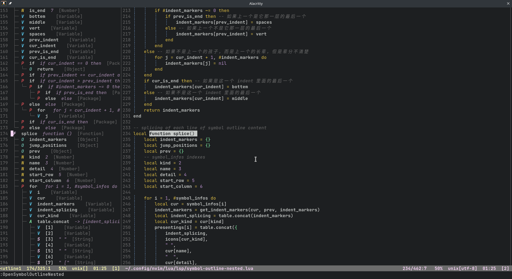
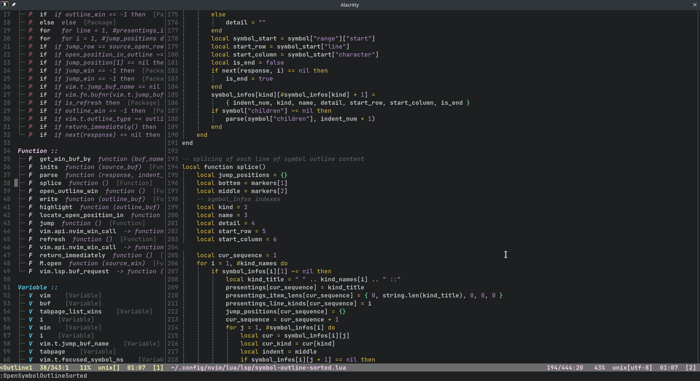
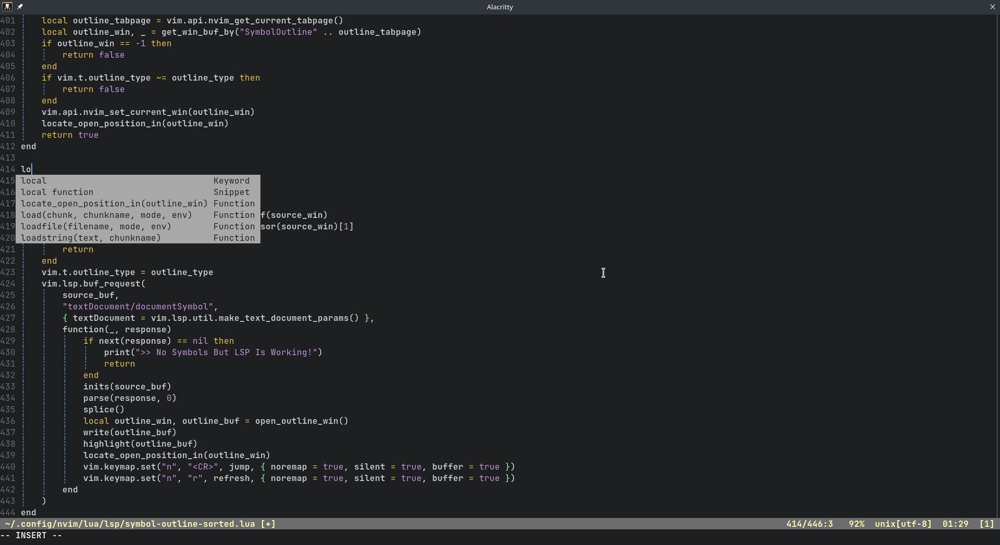
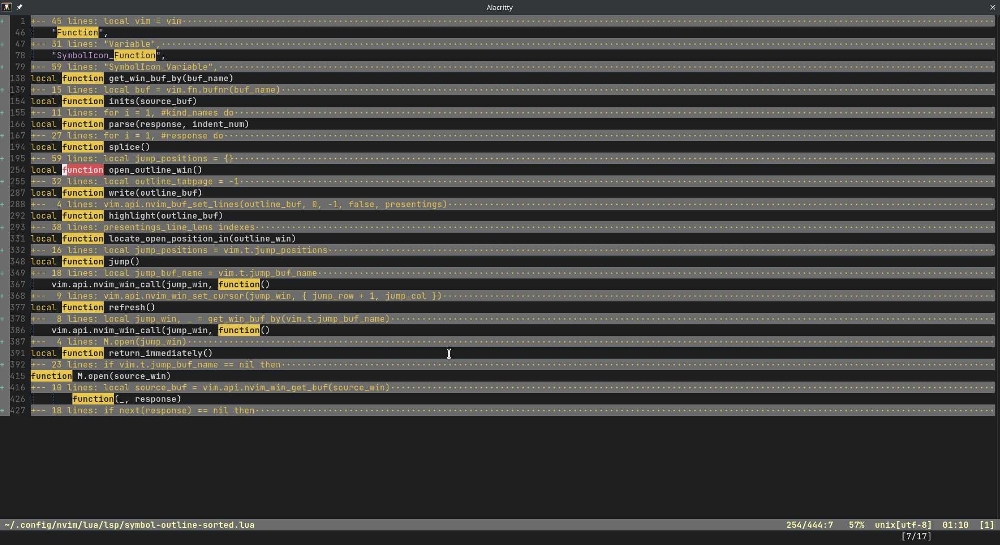
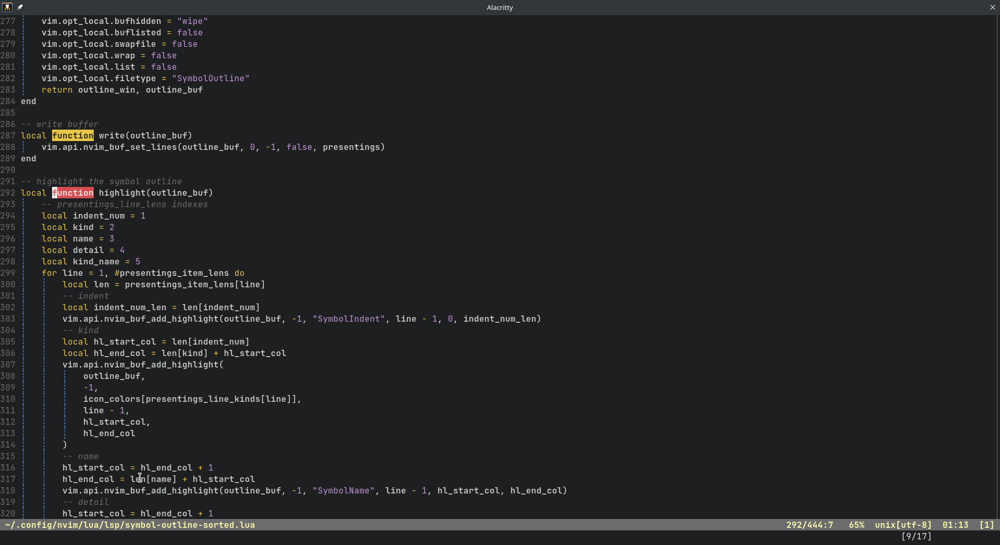
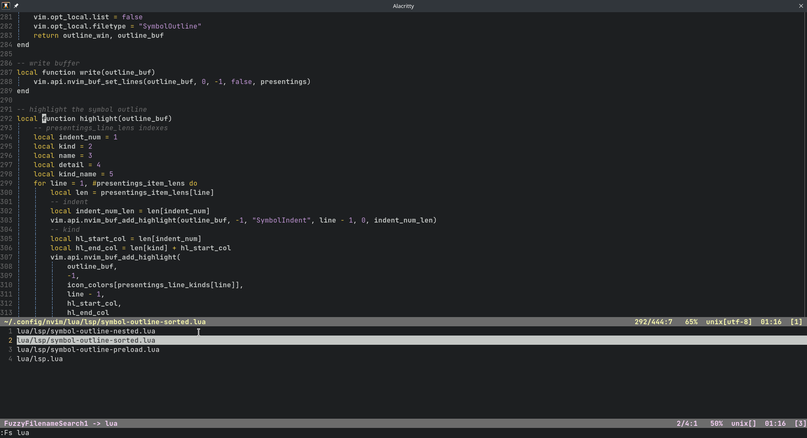
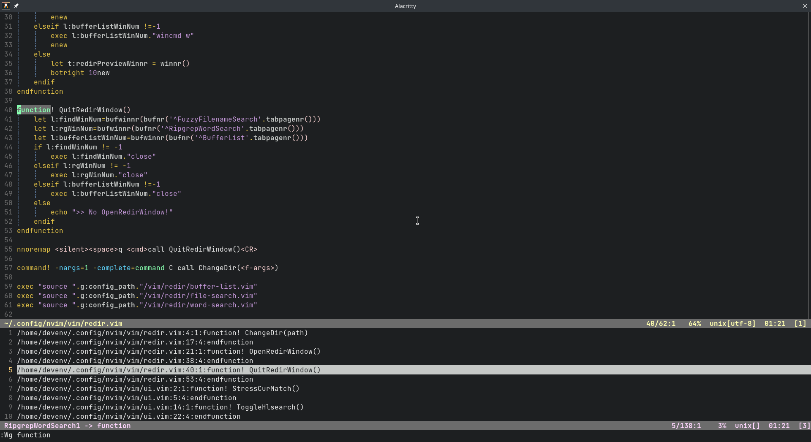
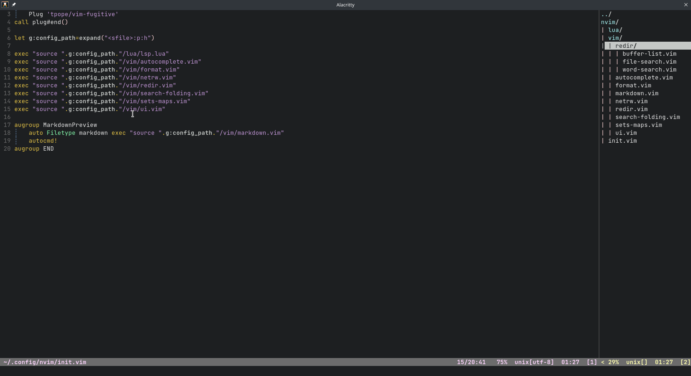

## Welcome to my neovim config without any plugins! ( NeoVIM >= 0.10 )

## Table of contents
- [Configuration presentations](#configuration-presentations)
    - [A symbol outline in nested view](#a-symbol-outline-in-nested-view)
    - [A symbol outline in sorted view](#a-symbol-outline-in-sorted-view)
    - [Autocomplete with the build-in omnifunc](#autocomplete-with-the-build-in-omnifunc)
    - [Folding according to after the pattern match](#folding-according-to-after-the-pattern-match)
    - [Focus on the cur word after the pattern match](#focus-on-the-cur-word-after-the-pattern-match)
    - [A fuzzy file search without gitignore](#a-fuzzy-file-search-without-gitignore)
    - [A fuzzy file word with gitignore](#a-fuzzy-word-search-with-gitignore)
    - [A simple buffer switching that lists all buffers](#a-simple-buffer-switching-that-lists-all-buffers)
    - [Keep netrw state](#keep-netrw-state)
    - [LSP config](#lsp-config)
- [Install](#install)
    - [Nvim With LSP](#nvim-with-lsp)
    - [Nvim Without LSP](#nvim-without-lsp)
    - [Vim Without LSP](#vim-without-lsp)
    - [Nodejs](#nodejs)
    - [In ubuntu docker](#in-ubuntu-docker)
    - [Quickly edit config](#quickly-edit-config)
    - [Miniconda](#miniconda)
    - [Fcitx](#fcitx)
    - [Bashrc](#bashrc)

## Configuration presentations

- ### A symbol outline in nested view

    - Opened by `OpenSymbolOutlineNested` command.
    - When firstly opened, match the symbol under the cursor in the source file, with the symbol in symbol-outline if it could.
    - When cursor in then symbol-outline win, press `r` to refresh the symbol-outline.
    - When cursor in then symbol-outline win, press `<CR>` to locate the symbol under the cursor in the source file.

    

- ### A symbol outline in sorted view

    - Opened by `OpenSymbolOutlineSorted` command
    - Others same as the symbol-outline sorted view.

    

- ### Autocomplete with the build-in omnifunc

    - Use the `<TAB>`, `<S-TAB>` or `<UP>` and `<DOWN>` to select a complementary item.

    

- ### Folding according to after the pattern match

    - Toggled by `<SPACE>z`.

    

- ### Focus on the cur word after the pattern match

    

- ### A fuzzy file search without gitignore

    - Opened by `Fs` command.
    - Or use `Fg` to search with gitignore.
    - Powered by ripgrep.
    - Case insensitive search.
    - When cursor in the file search result win, press `j` or `k` to quickly preview the contents, `<CR>` to jump to the file.
    - `<SPACE>q` to quit it anywhere.

    

- ### A fuzzy word search with gitignore

    - Opened by `Wg` command.
    - Or use `Ws` to search without gitignore.
    - Powered by ripgrep.
    - Case insensitive search.
    - When cursor in the file search result win, press `j` or `k` to quickly preview the contents, `<CR>` to jump to the file.
    - `<SPACE>q` to quit it anywhere.

    

- ### A simple buffer switching that lists all buffers

    - Opened by `<SPACE>l`.
    - When cursor in the file search result win, press `j` or `k` to quickly preview the contents, `<CR>` to jump to the file.
    - `<SPACE>q` to quit it anywhere.

    

- ### Keep netrw state
    - When quit the netrw and reopen it, its states will lose, so I wrote a script to keep its state, make it to hide on the right side instead of closing it, toggled by `<SPACE>e`

    

- ### LSP config
    - LSP config can be found at `/lua/lsp.lua`, see the [nvim-lspconfig sever configuration codes](https://github.com/neovim/nvim-lspconfig/tree/master/lua/lspconfig/server_configurations) for more languages sever that you need

***

- ### If you have better ideas on my config without any plugins, please let me know! I think we can discuss happily!

## Install

### Nvim With LSP
To use neovim config with lsp, you can download files to your customized path or run the following one-line command:

```bash
curl -sL https://raw.githubusercontent.com/HCY-ASLEEP/NVIM-Config/main/nvim-config.sh | sh
```
</br>

### Nvim Without LSP
To use neovim config without lsp but with self-contained auto completion of neovim, you can download files to your customized path or run the following one-line command:

```bash
curl -sL https://raw.githubusercontent.com/HCY-ASLEEP/NVIM-Config/main/nvim-config-without-lsp/nvim-config.sh | sh
```
</br>

### Vim Without LSP
To use vim config without lsp but with self-contained auto completion of vim, you can download files to your customized path or run the following one-line command:

```bash
curl -sL https://raw.githubusercontent.com/HCY-ASLEEP/NVIM-Config/main/vim-config-without-lsp.sh | sh
```
**WARNING** : Please carefully notice the content of vim-config-without-lsp.sh, this will damage the content of ~/.config/nvim/ !!!!!!

</br>

### Nodejs
To install latest nodejs in China, you can run the following one-line command, but before running the command I strongly recommand switching to a non-root user firstly:

```bash
curl -sL https://raw.githubusercontent.com/HCY-ASLEEP/NVIM-Config/main/nodejs-installer.sh | bash
```

</br>

### In ubuntu docker
To quickly config your neovim develop environment in docker ubuntu, after enter the bash shell of docker ubuntu, you can try these commands:

```bash
apt update;\
    apt upgrade -y;\
    apt install neovim xz-utils curl sudo git apt-transport-https ca-certificates ripgrep -y;\
    useradd -m devenv;\
    usermod -s /bin/bash devenv;\
    sudo sh -c 'echo "devenv ALL=(ALL) NOPASSWD:ALL" >> /etc/sudoers';\
    sudo chown devenv /home/devenv/;\
    sudo chgrp devenv /home/devenv/;\
    su devenv
```

</br>

### Quickly edit config
To edit nvim config easily, you can:

```bash
echo "alias iv = 'nvim ~/.config/nvim/init.vim'" >> ~/.bashrc
echo "alias v = 'nvim" >> ~/.bashrc
```

</br>

### Miniconda
To install miniconda of docker ubuntu in China, you must 'su devenv' first!!! Then exec follows:
```bash
curl https://mirrors.tuna.tsinghua.edu.cn/anaconda/miniconda/Miniconda3-latest-Linux-x86_64.sh -o ~/miniconda.sh;\
    sh ~/miniconda.sh -b;\
    rm ~/miniconda.sh;\
    ~/miniconda3/bin/conda init bash;\
    sed -n '/# >>> conda initialize >>>/,/# <<< conda initialize <<</p' ~/.bashrc >> ~/.condainit;\
    sed -i '/# >>> conda initialize >>>/,/# <<< conda initialize <<</d' ~/.bashrc;\
    echo 'alias cab="source ~/.condainit"' >> ~/.bashrc;\
    . ~/.bashrc
```
Then you can activate the conda env using 'cab' ( alias of 'conda activate base' )

</br>

### Fcitx
To use fcitx input methed in GUI programes of the container, you can run commands below:

```bash
sudo sh -c 'echo "\nexport GTK_IM_MODULE=fcitx\nexport QT_IM_MODULE=fcitx\nexport XMODIFIERS=@im=fcitx\n" >> /etc/bash.bashrc';\
    . /etc/bash.bashrc
```

However, fcitx may still not work in QT programes of the container. I had met this problem in xfce4 host environment, anyone has solutions can commit an issue, thanks.

</br>

### Bashrc
Here are configs of my host .bashrc:
```bash
PS1='\[\033[01;32m\]\u@\h\[\033[00m\]:\[\033[01;34m\]\w\[\033[00m\]\$ '

alias p='export ALL_PROXY=socks5://127.0.0.1:7890'
alias np='unset ALL_PROXY'
alias l='curl "http://172.30.255.42:801/eportal/portal/login?user_account=392432&user_password=12542614" ; echo'
alias v='nvim'
alias iv='nvim ~/.config/nvim/init.vim'
alias devenv='xhost + >> /dev/null;\
    podman start devenv;\
    podman exec -it \
        -e XMODIFIERS=$XMODIFIERS \
        -e QT_IM_MODULE=$QT_IM_MODULE \
        -e GTK_IM_MODULE=$GTK_IM_MODULE \
        -e DISPLAY=$DISPLAY \
        devenv /bin/bash -c \
        "cd /home/devenv/; su devenv;"'
alias u='sudo apt update; sudo apt upgrade -y;'
```
